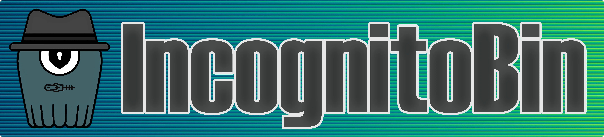

# 🥷 IncognitoBin

**IncognitoBin** is a modern, fast, and scalable pastebin alternative with a strong emphasis on security and privacy. Built with a **Rust** backend, **React** frontend, **ScyllaDB**, **Redis**, and **AES-256 encryption**, it offers a seamless, privacy-focused experience. All data is encrypted client-side, ensuring zero-server knowledge, while users can create accounts anonymously.

## ⚡ Features

- 🛡️ **End-to-End Encryption with AES-256**: Data is encrypted client-side using AES-256, a robust encryption standard, ensuring that only the user can access their information. The server remains unaware of the data's content (zero-server knowledge).
- 🎭 **Anonymous Account System**: Users are assigned a unique account number upon sign-up, which they use for logging in, maintaining full anonymity and avoiding the need for personal information.
- 🔐 **Zero-Knowledge Architecture**: Since all data is encrypted on the client side, **even IncognitoBin administrators or the project owner cannot view stored data**.
- ⚡ **Scalable Infrastructure**: IncognitoBin leverages Rust, ScyllaDB, and Redis, ensuring it can handle high traffic and maintain low latency.
- 🌟 **Open Source**: As an open-source project, IncognitoBin encourages transparency and community involvement in development.
- ⏳ **Automatic Paste Expiry**: Set custom expiration times for your pastes, after which they are permanently deleted from the system.
- 🔍 **Private Search**: Search through your own pastes without compromising privacy.
  
## 🌐 Try It Online

To experience IncognitoBin without a local installation, visit [IncognitoBin.com](https://IncognitoBin.com).

## 🛠️ Quick Setup

### Prerequisites
- Docker
- Docker Compose

### Installation Steps
1. Download the Docker Compose file:
```bash

curl -O https://raw.githubusercontent.com/IncognitoBin/IncognitoBin/refs/heads/master/docker-compose.yml
```
2. Start all the services:
```bash

docker compose up -d
```
Wait approximately 30 seconds for the services to initialize.

3. Access IncognitoBin:
Open your browser and navigate to `http://localhost:8008`

## 🛡️ Complete Data Privacy

IncognitoBin uses a **zero-knowledge architecture**: all data is encrypted in the browser using AES-256 before it is sent to the server. Because encryption occurs on the client side, **only the user with the correct decryption key (stored locally) can access the content**. This design ensures:

- 🔒 **Complete Data Privacy**: No plaintext data is ever transmitted or stored, making it unreadable by anyone without the user's key.
- 👁️‍🗨️ **No Access for Administrators**: Not even the IncognitoBin owner or administrators can view or access user data.
- 🗝️ **Secure Key Management**: Encryption keys never leave your device and are not stored on our servers.
- 🔄 **Forward Secrecy**: Each paste uses a unique encryption key, limiting potential exposure.
- 🚫 **No Tracking or Analytics**: We don't use any analytics or tracking tools that could compromise privacy.

In the event of a data breach, only encrypted data would be exposed, and without the decryption key, it would remain unreadable.

## 🤝 Contributing

We welcome contributions! To contribute:

1. Fork the repository
2. Create a feature branch: `git checkout -b feature-name`
3. Commit your changes: `git commit -m 'Add feature'`
4. Push to the branch: `git push origin feature-name`
5. Submit a pull request

Please ensure your code follows our style guide and includes appropriate tests.

## 📜 License

This project is licensed under the MIT License. See the [LICENSE](LICENSE) file for details.

## 💫 Support

- 🐛 Report issues on [GitHub](https://github.com/IncognitoBin/IncognitoBin/issues)
- 📖 Read our [Documentation](https://docs.incognitobin.com)
